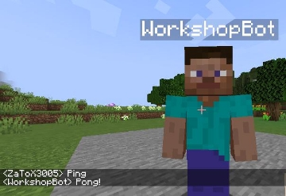
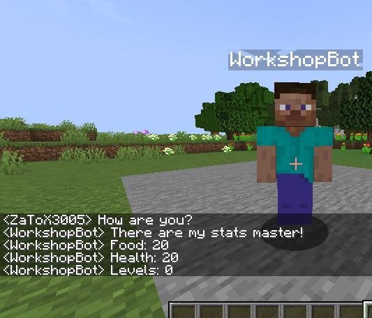

# Workshop

## Create A.I to control Minecraft Player

<center>
  
</center>

## Install

**language**: Javascript

For the smooth running of the Workshop it is necessary to correctly install nodejs and each of the modules of the library.

Follow each steps :

- Install and update Nodejs <https://www.geeksforgeeks.org/installation-of-node-js-on-linux/>
- Install Java jdk and runtime 17

```bash 
sudo apt-get install oracle-java17-installer oracle-java17-set-default
```

Execute ```java --version``` if there is this output it's good:

```bash
java 17 2021-09-14 LTS

Java(TM) SE Runtime Environment (build 17+35-LTS-2724)

Java HotSpot(TM) 64-Bit Server VM (build 17+35-LTS-2724, mixed mode, sharing)
```

Else execute ```sudo update-alternatives --config java``` and choose java17 version.

Link to install Minecraft Launcher if you don't have it : 
[Minecraft Launcher](https://www.launchershiginima.com/en/v4400/)

Link to download server.jar : 
[Server Jar](https://getbukkit.org/get/bf7ac3b5bc08ea97d22919680d240a80)

Create a folder named **‘WorkshopAIMinecraft’**, inside it another named **‘server’** and put your spigot-1.18.1.jar file inside it.

Now go with your shell inside **‘WorkshopAIMinecraft’** folder and install all the library with theses commands:

```bash
npm i mineflayer --save

npm i mineflayer-navigate --save npm i mineflayer-pathfinder --save npm i minecraft-data --save

npm i vec3 --save

npm install prismarine-viewer --save
```

Finally here is the Github link containing all the documentation that will be useful to you later

<https://github.com/PrismarineJS/mineflayer>

## Setup Server

If you've never set up a minecraft server don't worry it's not complicated. Go into your server folder and launch server with

```bash
java -Xms512M -Xmx1024M -jar spigot-1.18.1.jar
```

and accept change the variable to **'true'** in eula.txt.

When the server is already launch, stop it, go into server.properties file and change to 'false' the 'online-mode'.

Now if you open your Minecraft Launcher, go to multiplayer, add a new server with ip address ‘localhost’ you can connect to your local server.

It is on this one that we will carry out all the tests for our bot.

# Create our bot

You will first create a bot.js file in your folder **‘WorkshopAIMinecraft’**

This is where we will create all the code for our bot.

I will give you the base file to have with the base required module, to begin a bot.

```bash 
const mineflayer = require('mineflayer')

const bot = mineflayer.createBot({ username: 'BotOf\_YOUR\_NAME' })

bot.once('spawn', () => {

//Write your code here })


bot.on('kicked', console.log) bot.on('error', console.log) bot.on("end", () => bot = createBot());
```

Normally if you run your bot.js file with node. Your bot will connect itself to your local server. (Which must be launched obviously)

Your first goal is to create a basic ‘Ping’, ‘Pong’ message with your bot in Minecraft tchat.

Like this:
<center>
  
</center>

Tips: You will find all answers to your question on documentation.

# His first steps

Okay good, now we will teach him to do his first steps.

We need to call him with a command in the tchat and he will come to your coordinates.

You will need another module on the documentation to do that good luck!

```js
const mineflayer = require('mineflayer')

const bot = mineflayer.createBot({ username: 'BotOf\_YOUR\_NAME' }) bot.once('spawn', () => {
    bot.on("EVENT_TO_FIND_IN_PREVIOUSLY_TASK", (username, message) => {
        if (message === 'come' && username === "YOUR_USERNAME") {
          // Code to implement to call bot
        }
    })
})

bot.on('kicked', console.log) bot.on('error', console.log) bot.on("end", () => bot = createBot());
```

There may also be includes to add.

When this task is finished you are normally able to call your bot wherever you are just by saying ‘come’.

Try to add this to in ‘spawn’ event, and punch you bot it’s funny:

```js
bot.on('entityHurt', (entity) => {
    bot.chat('Ouchh!')
})
```


# Get his stats

Now you can move your bot, you need to know if he is in good health, so search in documentation how to get his health, food and experiences levels.

And print them in tchat when you ask him ‘How are you?’.

```js
if (message === 'How are you?' && username === 'YOUR_USERNAME') {
    // Code to implement to get his statistics
}
```

In game it will look something like this:

<center>
  
</center>

# More difficult

The previous parts were pretty easy now that you are familiar with the documentation. you'll teach your bot how to get a note block in creative and use it to play music.

You can manually set your bot in gamemode creative, with the server console. But he must take the note block himself.

```bash
const mineflayer = require('mineflayer')

const bot = mineflayer.createBot({ username: 'BotOf_YOUR_NAME' })
bot.once('spawn', () => {
    bot.on('EVENT_TO_FIND_IN_PREVIOUSLY_TASK', (username, message) => {
        if (message === 'Play me music' && username === 'YOUR_USERNAME') {
            // Code to implement to listen your bot playing music
        }
    })
})

bot.on('kicked', console.log) bot.on('error', console.log) bot.on("end", () => bot = createBot());
```

Don't hesitate to ask for help if you get stuck somewhere. I won't help you :)
